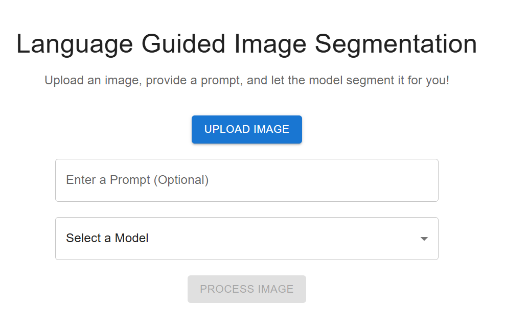

# Image Segmentation Chatbot

A chatbot web app capable of accepting both an image and a prompt (e.g., "Dog"). The chatbot displays the segmented image as output.

## Overview

This application allows users to interact with an AI-powered chatbot for image segmentation. Users can upload an image and provide a prompt to identify and segment specific objects or areas in the image.




## Installation
1. Clone the repository:
    ```sh
    git clone https://github.com/MahletH/cvgri-seg
    ```
### Backend
2. Navigate to the backend directory:
    ```sh
    cd back-end
    ```
3. Create a virtual environment:
    ```sh
    pip install virtualenv
    virtualenv -p python3.11 venv
    ```
4. Activate the virtual environment:
    - On macOS/Linux:
        ```sh
        source venv/bin/activate
        ```
    - On Windows:
        ```sh
        .\venv\Scripts\activate
        ```
5. Install the dependencies:
    ```sh
    pip install -r requirements.txt
    ```
6. Start the backend server:
    ```sh
    python main.py
    ```

### Frontend
2. Navigate to the frontend directory:
    ```sh
    cd front-end
    ```
3. Install the dependencies:
    ```sh
    npm install
    ```
4. Start the frontend server:
    ```sh
    npm start
    ```

## Testing

1. Ensure both the backend and frontend servers are running.
2. Open your browser and navigate to `http://localhost:3000` to test the frontend.
3. Use tools like Postman or curl to test the backend endpoints.

## Conclusion

You have successfully set up and tested both the frontend and backend.